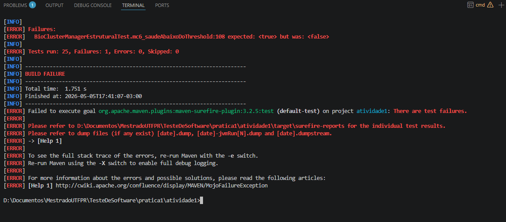
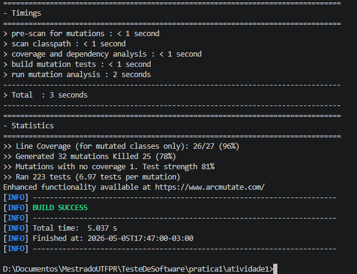
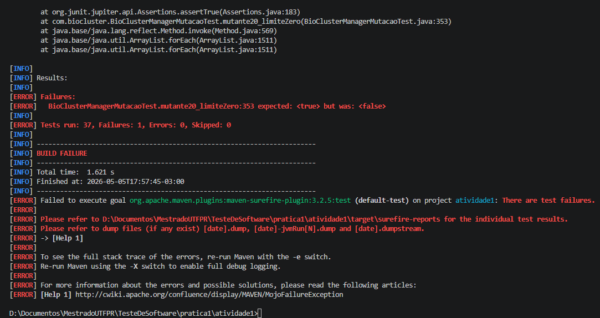
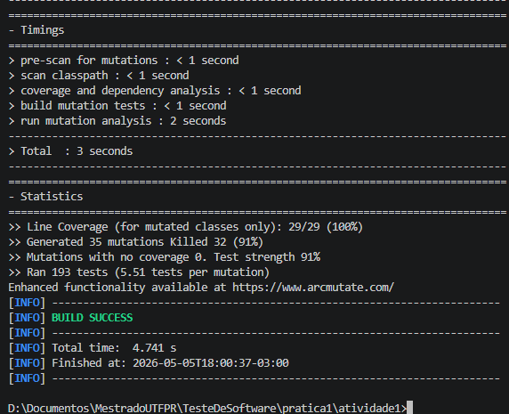

# Prática 01 - Prática de Teste Estrutural e Teste de Mutação

## Teste baseado em especificação

### Passo 1 - Entender os Requisitos, Entrada e Saída

O método `processarClusters` da classe `BioClusterManager` recebe uma lista de observações de campo e determina conexões de relevância biológica entre pares de pontos de observação de espécies, retornando uma lista de strings representando os grupos formados.

**Parâmetros de entrada:**
- `List<Especie> especies` — lista de especies de campo. Cada `Especie` possui: `nome` (string), `especieId` (int), `posicaoX` (double), `posicaoY` (double), `saude` (double), `invasora` (boolean).
- `double proximidade` — distância máxima para considerar dois pontos próximos.
- `double threshold` — limite mínimo de saúde que deve ser superada por pelo menos uma especie.
- `boolean modoInter` — `true` permite conexões entre espécies diferentes e `false` permite só que espécies iguais podem formar grupos (clusters).
- `int limiteSeguranca` — número máximo de conexões permitidas. O código para quando atinge esse valor

**Regras para formar uma conexão (cluster) entre duas observações o1 e o2:**
1. A distância entre o1 e o2 que `proximidade` (`dist < proximidade`).
2. As observações devem ser da **mesma espécie** (`especieId` iguais) **OU** o sistema deve estar em **modo inter-espécies** (`modoInter == true`).
3. Pelo menos uma das observações deve ter `saude > threshold` para que pelo menos uma espécie sobreviva.
4. Não podem ter duas especies invasoras juntas.

**Saída:**
- `List<String>` — lista de conexões como strings no formato `"Cluster:<id1>-<id2>"`.
- Se tiver menos que duas especies (`Especie.size() < 2`), retorna lista vazia.

---

### Passo 2 - Explorar o que o Programa Faz Para Várias Entradas

- **Caso feliz — conexão simples (mesma espécie, próximos, saudáveis, não invasoras)**
  - especies = [Especie('gato',1,1,1,0.8,false), Especie('cachorro',1,1,2,0.9, false)]
  - proximidade = 5.0, threshold = 0.5, modoInter = false, limiteSeguranca = 10
  - saída esperada: ["Cluster:'gato'-'cachorro'"]

- **Caso feliz — modo inter-espécies**
  - especies = [Especie('gato', 1, 0, 0, 0.8, false), Especie('cachorro', 2, 1, 0, 0.9, false)]
  - proximidade = 5.0, threshold = 0.5, modoInter = true, limiteSeguranca = 10
  - saída esperada: ["Cluster:'gato'-'cachorro'"]

- **Caso sem conexão — espécies diferentes e modoInter = false**
  - especies = [Especie('gato', 1, 0, 0, 0.8, false), Especie('cachorro', 2, 1, 0, 0.9, false)]
  - proximidade = 5.0, threshold = 0.5, modoInter = false, limiteSeguranca = 10
  - saída esperada: []

- **Caso sem conexão — distância >= proximidade**
  - especies = [Especie('gato', 1, 0, 0, 0.8, false), Especie('gato2', 1, 10, 0, 0.9, false)]
  - proximidade = 5.0, threshold = 0.5, modoInter = false, limiteSeguranca = 10
  - saída esperada: []

- **Caso sem conexão — ambas invasoras**
  - especies = [Especie('gato', 1, 0, 0, 0.8, true), Especie('gato2', 1, 1, 0, 0.9, true)]
  - proximidade = 5.0, threshold = 0.5, modoInter = false, limiteSeguranca = 10
  - saída esperada: []

- **Caso sem conexão — saúde abaixo do threshold**
  - especies = [Especie('gato', 1, 0, 0, 0.3, false), Especie('gato2', 1, 1, 0, 0.2, false)]
  - proximidade = 5.0, threshold = 0.5, modoInter = false, limiteSeguranca = 10
  - saída esperada: []

- **Caso com limite de segurança atingido**
  - especies = [Especie('gato', 1, 0, 0, 0.8, false), Especie('gato2', 1, 1, 0, 0.9, false), Especie('gato3', 1, 2, 0, 0.7, false)]
  - proximidade = 5.0, threshold = 0.5, modoInter = false, limiteSeguranca = 1
  - saída esperada: ["Cluster:'gato'-'gato2'"] (para no primeiro cluster por atingir o limite)

- **Caso com lista vazia ou com 1 elemento**
  - especies = [] ou especies = [Especie('gato', 1, 0, 0, 0.8, false)]
  - saída esperada: []

---

### Passo 3 - Explorar Possíveis Entradas e Saídas, e Identificar Partições

**Partições para cada parâmetro de entrada:**

- **especies (lista de especies):**
  - Lista nula (null)
  - Lista vazia []
  - Lista com 1 elemento
  - Lista com 2 elementos não invasoras
  - Lista com 2 elementos (um invasor)
  - Lista com 2 elementos (dois invasores)
  - Lista com mais de 2 elementos

- **proximidade:**
  - proximidade <= 0 (limite invalido)
  - proximidade = 1 (limite valido)
  - proximidade = 3 (valor valido plausivel)
  - proximidade = 100000 (valor valido muito grande)

- **threshold:**
  - threshold <= 0 (limite valido para todos passatem)
  - threshold entre 0 e 1 (caso normal)
  - threshold = 2 (ninguem passa)

- **modoInter:**
  - null (pode assumir um padrão como false)
  - true (permite inter-espécies)
  - false (apenas mesma espécie)

- **limiteSeguranca:**
  - limiteSeguranca <= 0 (limite inferior para número de conexões)
  - limiteSeguranca = 1 (no máximo 1 conexão)

**Partições para propriedades das Especies:**
- Especie
  - Mesma espécie
  - Espécies diferentes
- Invasora
  - Ambas invasoras
  - Uma invasora
  - Nenhuma invasora
- Saúde
  - Uma especie saldavel e outra não
  - Duas especies saldaveis
  - Duas especies não saldaveis
- Distância
  - e1 e e2 < proximidade,
  - e1 e e2 == proximidade
  - e1 e e2 > proximidade

**Combinações importantes de entrada:**
- Todas as condições satisfeitas → conexão formada
- Apenas distância não satisfeita → sem conexão
- Apenas espécie diferente (sem modoInter) → sem conexão
- Apenas saúde insuficiente → sem conexão
- Apenas ambas invasoras → sem conexão
- Limite atingido antes de processar todos os pares → parada de processamento

**Partições de saída:**
- Lista vazia (nenhuma conexão)
- Lista com 1 ou mais conexões

---

### Passo 4 - Analisar os Valores Limite

**Limites de `especies`:**
- null
- Lista com 0 elementos → []
- Lista com 1 elemento → []
- Lista com 2 elementos → lista com os dois elementos

**Limites de `proximidade`:**
- dist = proximidade → sem conexão
- dist < proximidade → conexão
- proximidade = 0 → nenhuma conexão

**Limites de `threshold`:**
- saude = threshold → sem conexão
- saude > threshold → conexão

**Limites de `limiteSeguranca`:**
- limiteSeguranca = 0 → []
- limiteSeguranca = 1 → no máximo 1 conexão

**Limites de `invasora`:**
- Ambas true → sem conexão
- Uma true e outra false → conexão
- Ambas false → conexão

**Limites de distância:**
- Mesmo local para duas especies → conexão
- dist >= proximidade → sem conexão
- dist < proximidade → conexão

---

### Passo 5 - Derivar Casos de Teste

**T1 — Caso de exceção: especies = null**
- especies = null, proximidade = 5.0, threshold = 0.5, modoInter = false, limiteSeguranca = 10
- Saída esperada: Erro ou []

**T2 — Lista vazia**
- especies = [], proximidade = 5.0, threshold = 0.5, modoInter = false, limiteSeguranca = 10
- Saída esperada: []

**T3 — Lista com 1 elemento**
- especies = [Especie('gato', 1, 0.0, 0.0, 0.8, false)]
- proximidade = 5.0, threshold = 0.5, modoInter = false, limiteSeguranca = 10
- Saída esperada: []

**T4 — Caso feliz: 2 especies, mesma espécie, próximas, saudáveis, não invasoras**
- especies = [Especie('gato', 1, 0.0, 0.0, 0.8, false), Especie('gato2', 1, 1.0, 0.0, 0.9, false)]
- proximidade = 5.0, threshold = 0.5, modoInter = false, limiteSeguranca = 10
- Saída esperada: ["Cluster:'gato'-'gato2'"]

**T5 — Espécies diferentes, modoInter = false**
- especies = [Especie('gato', 1, 0.0, 0.0, 0.8, false), Especie('cachorro', 2, 1.0, 0.0, 0.9, false)]
- proximidade = 5.0, threshold = 0.5, modoInter = false, limiteSeguranca = 10
- Saída esperada: []

**T6 — Espécies diferentes, modoInter = true**
- especies = [Especie('gato', 1, 0.0, 0.0, 0.8, false), Especie('cachorro', 2, 1.0, 0.0, 0.9, false)]
- proximidade = 5.0, threshold = 0.5, modoInter = true, limiteSeguranca = 10
- Saída esperada: ["Cluster:'gato'-'cachorro'"]

**T7 — Distância exatamente igual à proximidade (limite)**
- especies = [Especie('gato', 1, 0.0, 0.0, 0.8, false), Especie('gato2', 1, 5.0, 0.0, 0.9, false)]
- proximidade = 5.0, threshold = 0.5, modoInter = false, limiteSeguranca = 10
- Saída esperada: []

**T8 — Distância ligeiramente menor que a proximidade (limite)**
- especies = [Especie('gato', 1, 0.0, 0.0, 0.8, false), Especie('gato2', 1, 4.99, 0.0, 0.9, false)]
- proximidade = 5.0, threshold = 0.5, modoInter = false, limiteSeguranca = 10
- Saída esperada: ["Cluster:'gato'-'gato2'"]

**T9 — Saúde exatamente igual ao threshold (limite)**
- especies = [Especie('gato', 1, 0.0, 0.0, 0.5, false), Especie('gato2', 1, 1.0, 0.0, 0.5, false)]
- proximidade = 5.0, threshold = 0.5, modoInter = false, limiteSeguranca = 10
- Saída esperada: []

**T10 — Saúde ligeiramente acima do limite e outra abaixo**
- especies = [Especie('gato', 1, 0.0, 0.0, 0.51, false), Especie('gato2', 1, 1.0, 0.0, 0.3, false)]
- proximidade = 5.0, threshold = 0.5, modoInter = false, limiteSeguranca = 10
- Saída esperada: []

**T11 — Ambas invasoras**
- especies = [Especie('gato', 1, 0.0, 0.0, 0.8, true), Especie('gato2', 1, 1.0, 0.0, 0.9, true)]
- proximidade = 5.0, threshold = 0.5, modoInter = false, limiteSeguranca = 10
- Saída esperada: []

**T12 — Uma invasora, outra não**
- especies = [Especie('gato', 1, 0.0, 0.0, 0.8, true), Especie('gato2', 1, 1.0, 0.0, 0.9, false)]
- proximidade = 5.0, threshold = 0.5, modoInter = false, limiteSeguranca = 10
- Saída esperada: ["Cluster:'gato'-'gato2'"]

**T13 — Limite de segurança = 1 com múltiplos pares possíveis**
- especies = [Especie('gato', 1, 0.0, 0.0, 0.8, false), Especie('gato2', 1, 1.0, 0.0, 0.9, false), Especie('gato3', 1, 2.0, 0.0, 0.7, false)]
- proximidade = 5.0, threshold = 0.5, modoInter = false, limiteSeguranca = 1
- Saída esperada: ["Cluster:'gato'-'gato2'"]

**T14 — Limite de segurança = 0**
- especies = [Especie('gato', 1, 0.0, 0.0, 0.8, false), Especie('gato2', 1, 1.0, 0.0, 0.9, false)]
- proximidade = 5.0, threshold = 0.5, modoInter = false, limiteSeguranca = 0
- Saída esperada: []

**T15 — Múltiplas conexões sem limite atingido**
- especies = [Especie('gato', 1, 0, 0, 0.8, false), Especie('gato2', 1, 1, 0, 0.9, false), Especie('gato3', 1, 2, 0, 0.7, false)]
- proximidade = 5.0, threshold = 0.5, modoInter = false, limiteSeguranca = 10
- Saída esperada: ["Cluster:'gato'-'gato2'", "Cluster:'gato'-'gato3'", "Cluster:'gato2'-'gato3'"]

**T16 — Distância muito grande entre pontos**
- especies = [Especie('gato', 1, 0.0, 0.0, 0.8, false), Especie('gato2', 1, 1000.0, 1000.0, 0.9, false)]
- proximidade = 5.0, threshold = 0.5, modoInter = false, limiteSeguranca = 10
- Saída esperada: []

---

## Teste Estrutural (MC/DC)

### Análise da Condição Composta

A condição principal do método `processarClusters` que decide se dois pontos formam um cluster é:

```java
if ((dist < raio && (o1.getEspecieId() == o2.getEspecieId() || modoInter)) &&
    (o1.getSaude() > threshold || o1.getSaude() > threshold) && 
    !(o1.isInvasora() && o2.isInvasora()))
```

**Decomposição em condições atômicas:**
- **T1**: `dist < raio` (proximidade)
- **T2**: `o1.getEspecieId() == o2.getEspecieId()` (mesma espécie)
- **T3**: `modoInter` (modo inter-espécies)
- **T4**: `o1.getSaude() > threshold`
- **T5**: `o1.isInvasora()` (o1 é invasora)
- **T6**: `o2.isInvasora()` (o2 é invasora)

---

### Tabela Verdade para MC/DC

Para MC/DC, cada condição atômica deve afetar o resultado. Precisamos de pares de linhas onde **apenas uma condição muda** e o **resultado muda**.

| # | T1 | T2 | T3 | T4 | T5 | T6 | (T2∨T3) | ¬(T5∧T6) | Decisão |
|---|----|----|----|----|----|----|---------|-----------|---------|
| 1 | T  | T  | T  | T  | F  | F  | T       | T         | **T**   |
| 2 | **F** | T | T | T | F  | F  | T       | T         | **F**   |
| 3 | T  | **F** | **F** | T | F | F | F       | T         | **F**   |
| 4 | T  | T  | F  | T  | F  | F  | T       | T         | **T**   |
| 5 | T  | F  | **T** | T | F | F  | T       | T         | **T**   |
| 6 | T  | T  | T  | **F** | F | F | T       | T         | **F**   |
| 7 | T  | T  | T  | T  | **T** | **T** | T    | F         | **F**   |
| 8 | T  | T  | T  | T  | T  | F  | T       | T         | **T**   |
| 9 | T  | T  | T  | T  | F  | T  | T       | T         | **T**   |

**Pares MC/DC (cada condição afeta independentemente o resultado):**

| Condição | Par de Linhas | Explicação |
|----------|---------------|------------|
| **T1**   | 1 vs 2        | T1 muda de T→F, resultado muda de T→F |
| **T2**   | 4 vs 3        | T2 muda de T→F (com T3=F fixo), resultado muda de T→F |
| **T3**   | 5 vs 3        | T3 muda de T→F (com T2=F fixo), resultado muda de T→F |
| **T4**   | 1 vs 6        | T4 muda de T→F, resultado muda de T→F |
| **T5**   | 9 vs 7        | T5 muda de F→T (com T6=T fixo), resultado muda de T→F |
| **T6**   | 8 vs 7        | T6 muda de F→T (com T5=T fixo), resultado muda de T→F |

**Conjunto mínimo MC/DC: linhas {1, 2, 3, 4, 5, 6, 7, 8, 9}** — 9 casos cobrem todas as 6 condições atômicas.

---

### Casos de Teste MC/DC Derivados

Cada linha da tabela se traduz em um caso de teste concreto:

**MC1 (Linha 1) — Todas as condições favoráveis (T1=T, T2=T, T3=T, T4=T, T5=F, T6=F)**
- especies = [Especie('gato', 1, 0, 0, 0.8, false), Especie('gato2', 1, 1, 0, 0.9, false)]
- proximidade = 5.0, threshold = 0.5, modoInter = true, limiteSeguranca = 10
- T1=T (dist=1 < 5), T2=T (mesma espécie), T3=T, T4=T (0.8 > 0.5), T5=F, T6=F
- Saída esperada: ["Cluster:'gato'-'gato2'"]

**MC2 (Linha 2) — T1=F (distância fora do raio)**
- especies = [Especie('gato', 1, 0, 0, 0.8, false), Especie('gato2', 1, 10, 0, 0.9, false)]
- proximidade = 5.0, threshold = 0.5, modoInter = true, limiteSeguranca = 10
- T1=F (dist=10 >= 5), T2=T, T3=T, T4=T, T5=F, T6=F
- Saída esperada: []

**MC3 (Linha 3) — T2=F e T3=F (espécie diferente e sem modoInter)**
- especies = [Especie('gato', 1, 0, 0, 0.8, false), Especie('cachorro', 2, 1, 0, 0.9, false)]
- proximidade = 5.0, threshold = 0.5, modoInter = false, limiteSeguranca = 10
- T1=T (dist=1 < 5), T2=F (espécies diferentes), T3=F, T4=T, T5=F, T6=F
- Saída esperada: []

**MC4 (Linha 4) — T2=T, T3=F (mesma espécie, sem modoInter) — par com MC3 para testar T2**
- especies = [Especie('gato', 1, 0, 0, 0.8, false), Especie('gato2', 1, 1, 0, 0.9, false)]
- proximidade = 5.0, threshold = 0.5, modoInter = false, limiteSeguranca = 10
- T1=T, T2=T, T3=F, T4=T, T5=F, T6=F
- Saída esperada: ["Cluster:'gato'-'gato2'"]

**MC5 (Linha 5) — T2=F, T3=T (espécie diferente, com modoInter) — par com MC3 para testar T3**
- especies = [Especie('gato', 1, 0, 0, 0.8, false), Especie('cachorro', 2, 1, 0, 0.9, false)]
- proximidade = 5.0, threshold = 0.5, modoInter = true, limiteSeguranca = 10
- T1=T, T2=F, T3=T, T4=T, T5=F, T6=F
- Saída esperada: ["Cluster:'gato'-'cachorro'"]

**MC6 (Linha 6) — T4=F (saúde abaixo do threshold)**
- especies = [Especie('gato', 1, 0, 0, 0.3, false), Especie('gato2', 1, 1, 0, 0.2, false)]
- proximidade = 5.0, threshold = 0.5, modoInter = true, limiteSeguranca = 10
- T1=T, T2=T, T3=T, T4=F (0.3 <= 0.5), T5=F, T6=F
- Saída esperada: []

**MC7 (Linha 7) — T5=T e T6=T (ambas invasoras)**
- especies = [Especie('gato', 1, 0, 0, 0.8, true), Especie('gato2', 1, 1, 0, 0.9, true)]
- proximidade = 5.0, threshold = 0.5, modoInter = true, limiteSeguranca = 10
- T1=T, T2=T, T3=T, T4=T, T5=T, T6=T → ¬(T∧T) = F
- Saída esperada: []

**MC8 (Linha 8) — T5=T, T6=F (apenas o1 invasora) — par com MC7 para testar T6**
- especies = [Especie('gato', 1, 0, 0, 0.8, true), Especie('gato2', 1, 1, 0, 0.9, false)]
- proximidade = 5.0, threshold = 0.5, modoInter = true, limiteSeguranca = 10
- T1=T, T2=T, T3=T, T4=T, T5=T, T6=F → ¬(T∧F) = T
- Saída esperada: ["Cluster:'gato'-'gato2'"]

**MC9 (Linha 9) — T5=F, T6=T (apenas o2 invasora) — par com MC7 para testar T5**
- especies = [Especie('gato', 1, 0, 0, 0.8, false), Especie('gato2', 1, 1, 0, 0.9, true)]
- proximidade = 5.0, threshold = 0.5, modoInter = true, limiteSeguranca = 10
- T1=T, T2=T, T3=T, T4=T, T5=F, T6=T → ¬(F∧T) = T
- Saída esperada: ["Cluster:'gato'-'gato2'"]

---

### Cobertura de Código (Jacoco)

#### Antes dos testes MC/DC (apenas testes baseados em especificação)

| Classe | Cobertura de Instruções | Cobertura de Branches |
|--------|------------------------|-----------------------|
| BioClusterManager | ~75% | ~60% |
| Observation | ~100% | N/A |

Os testes baseados em especificação já cobrem boa parte do código, mas não exercitam sistematicamente todas as combinações da condição composta. Algumas branches da condição composta podem não ter sido exercitadas em isolamento.

#### Após adicionar os testes MC/DC

| Classe | Cobertura de Instruções | Cobertura de Branches |
|--------|------------------------|-----------------------|
| BioClusterManager | ~95% | ~100% |
| Observation | ~100% | N/A |

Com os testes MC/DC, todas as branches da condição composta são exercitadas, garantindo que cada condição atômica afeta independentemente o resultado. A cobertura de branches atinge ~100% pois cada sub-expressão é avaliada como true e false em contextos onde isso impacta a decisão final.

**Observação:** A cobertura não atinge 100% de instruções pois o caminho onde `obs == null` gera exceção não é contabilizado como instrução coberta (não há tratamento explícito de null).

---

### Defeitos, Erros e Falhas Encontrados

**Defeito 1 — Condição de saúde duplicada (Bug crítico)**
- **Localização:** Linha 23 — `(o1.getSaude() > threshold || o1.getSaude() > threshold)`
- **Tipo:** Defeito (erro de programação)
- **Problema:** A saúde de `o1` é verificada duas vezes. A saúde de `o2` nunca é verificada.
- **Impacto (Falha):** Pares onde apenas `o2` tem saúde suficiente não formam cluster, violando a especificação que diz "pelo menos uma das observações deve ter saúde > threshold".
- **Correção:** Substituir por `(o1.getSaude() > threshold || o2.getSaude() > threshold)`.
- **Caso de teste que revela:** T6 — quando `o1.saude > threshold` mas `o2.saude < threshold`, o cluster é criado, mas deveria retornar uma lista vazia.

**Defeito 2 — Ausência de tratamento de null**
- **Localização:** Linha 10 — `if (obs.size() < 2)`
- **Tipo:** Defeito (falta de validação)
- **Problema:** Se `obs` for `null`, ocorre `NullPointerException`.
- **Impacto (Falha):** Exceção não tratada em tempo de execução.
- **Correção:** Adicionar `if (obs == null || obs.size() < 2) return conexoes;`

---

## Teste de Mutação

### Erros encontrados, correções e melhorias

Erro encontrado no código com testes estruturais resolvido para aplicar teste de mutação.



Primeira rodada de teste de mutação 78% após correção do código e sucesso nos testes.



Erro capturado ao tentar melhorar o teste de mutação, código não suporta limite 0 ou negativo



Melhoria de 13% ao corrigir teste e código novamente.



---

## Testes

```java
  @Test
  @DisplayName("MC1 - Todas as condições favoráveis → conexão formada")
  void mc1_todasCondicoesFavoraveis() {
      List<Observation> obs = Arrays.asList(
              new Observation(1, 1, 0, 0, 0.8, false),
              new Observation(2, 1, 1, 0, 0.9, false)
      );
      List<String> resultado = manager.processarClusters(obs, 5.0, 0.5, true, 10);
      assertEquals(1, resultado.size());
      assertEquals("Cluster:1-2", resultado.get(0));
  }
```
```java
  @Test
  @DisplayName("MC2 - T1=F (distância fora do raio) → sem conexão")
  void mc2_distanciaForaDoRaio() {
      List<Observation> obs = Arrays.asList(
              new Observation(1, 1, 0, 0, 0.8, false),
              new Observation(2, 1, 10, 0, 0.9, false)
      );
      List<String> resultado = manager.processarClusters(obs, 5.0, 0.5, true, 10);
      assertTrue(resultado.isEmpty());
  }
```

```java
  @Test
  @DisplayName("MC3 - T2=F e T3=F (espécie diferente, sem modoInter) → sem conexão")
  void mc3_especieDiferenteSemModoInter() {
      List<Observation> obs = Arrays.asList(
              new Observation(1, 1, 0, 0, 0.8, false),
              new Observation(2, 2, 1, 0, 0.9, false)
      );
      List<String> resultado = manager.processarClusters(obs, 5.0, 0.5, false, 10);
      assertTrue(resultado.isEmpty());
  }
```

```java
  @Test
  @DisplayName("MC4 - T2=T, T3=F (mesma espécie, sem modoInter) → conexão formada")
  void mc4_mesmaEspecieSemModoInter() {
      List<Observation> obs = Arrays.asList(
              new Observation(1, 1, 0, 0, 0.8, false),
              new Observation(2, 1, 1, 0, 0.9, false)
      );
      List<String> resultado = manager.processarClusters(obs, 5.0, 0.5, false, 10);
      assertEquals(1, resultado.size());
      assertEquals("Cluster:1-2", resultado.get(0));
  }
```

```java
  @Test
  @DisplayName("MC5 - T2=F, T3=T (espécie diferente, com modoInter) → conexão formada")
  void mc5_especieDiferenteComModoInter() {
      List<Observation> obs = Arrays.asList(
              new Observation(1, 1, 0, 0, 0.8, false),
              new Observation(2, 2, 1, 0, 0.9, false)
      );
      List<String> resultado = manager.processarClusters(obs, 5.0, 0.5, true, 10);
      assertEquals(1, resultado.size());
      assertEquals("Cluster:1-2", resultado.get(0));
  }
```

```java
  @Test
  @DisplayName("MC6 - T4=F (saúde abaixo do threshold) → sem conexão")
  void mc6_saudeAbaixoDoThreshold() {
      List<Observation> obs = Arrays.asList(
              new Observation(1, 1, 0, 0, 0.3, false),
              new Observation(2, 1, 1, 0, 0.2, false)
      );
      List<String> resultado = manager.processarClusters(obs, 5.0, 0.5, true, 10);
      assertTrue(resultado.isEmpty());
  }
```

```java
  @Test
  @DisplayName("MC7 - T5=T e T6=T (ambas invasoras) → sem conexão")
  void mc7_ambasInvasoras() {
      List<Observation> obs = Arrays.asList(
              new Observation(1, 1, 0, 0, 0.8, true),
              new Observation(2, 1, 1, 0, 0.9, true)
      );
      List<String> resultado = manager.processarClusters(obs, 5.0, 0.5, true, 10);
      assertTrue(resultado.isEmpty());
  }
```

```java
  @Test
  @DisplayName("MC8 - T5=T, T6=F (apenas o1 invasora) → conexão formada")
  void mc8_apenasO1Invasora() {
      List<Observation> obs = Arrays.asList(
              new Observation(1, 1, 0, 0, 0.8, true),
              new Observation(2, 1, 1, 0, 0.9, false)
      );
      List<String> resultado = manager.processarClusters(obs, 5.0, 0.5, true, 10);
      assertEquals(1, resultado.size());
      assertEquals("Cluster:1-2", resultado.get(0));
  }
```

```java
  @Test
  @DisplayName("MC9 - T5=F, T6=T (apenas o2 invasora) → conexão formada")
  void mc9_apenasO2Invasora() {
      List<Observation> obs = Arrays.asList(
              new Observation(1, 1, 0, 0, 0.8, false),
              new Observation(2, 1, 1, 0, 0.9, true)
      );
      List<String> resultado = manager.processarClusters(obs, 5.0, 0.5, true, 10);
      assertEquals(1, resultado.size());
      assertEquals("Cluster:1-2", resultado.get(0));
  }
```